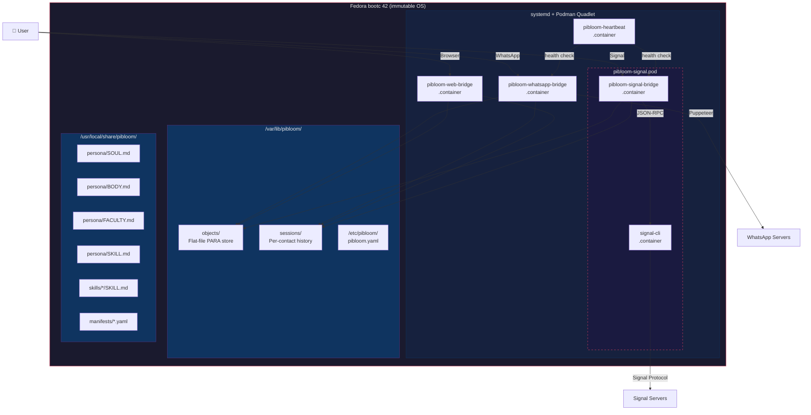
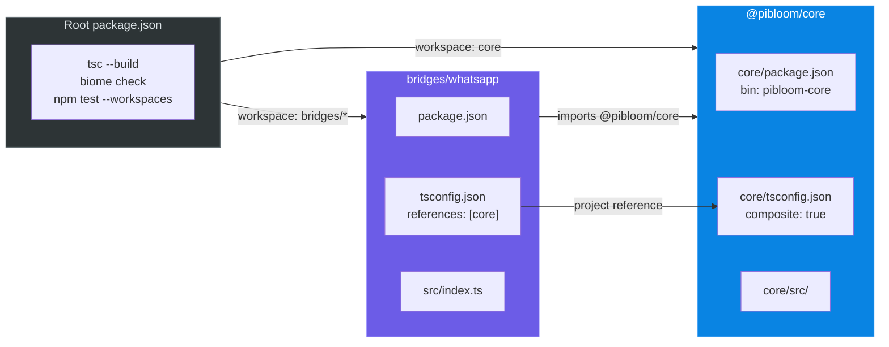
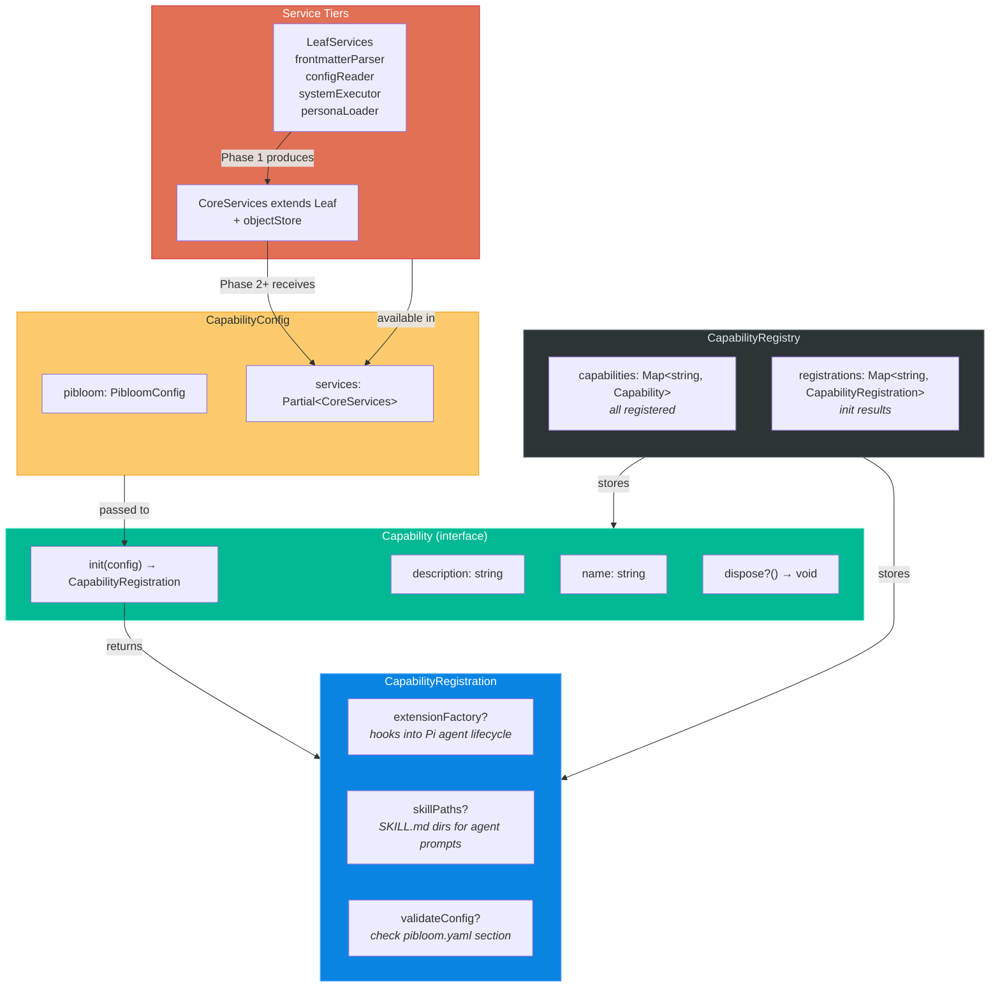
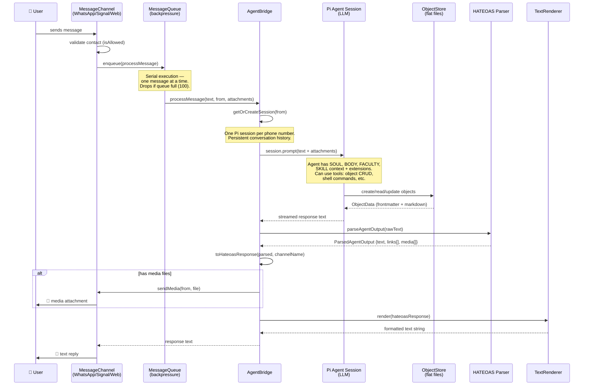
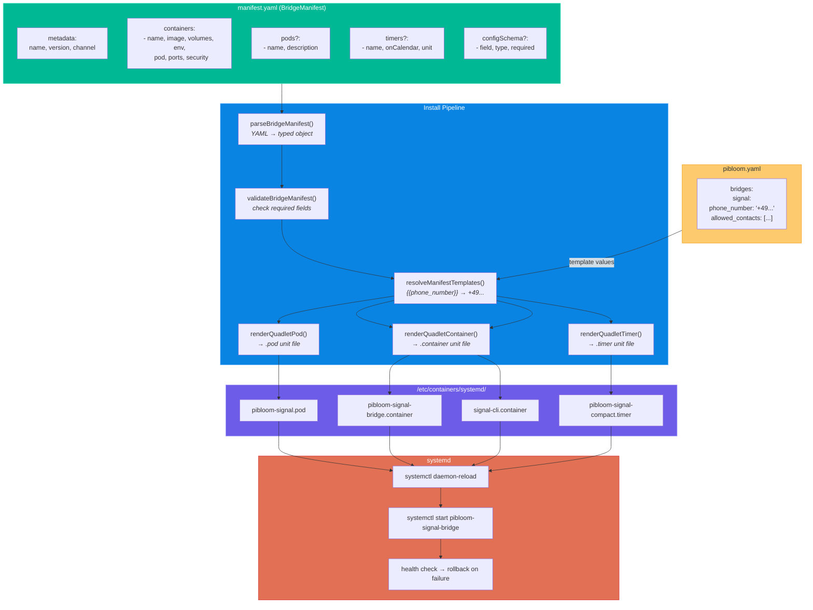
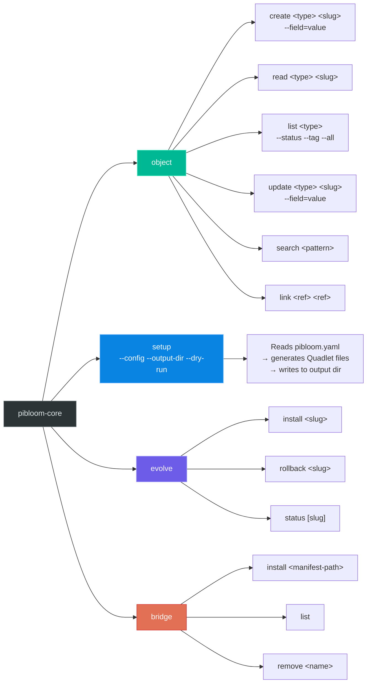
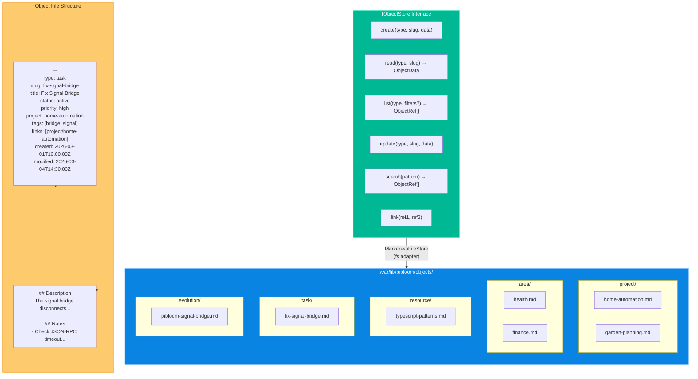

# piBloom Architecture Diagrams

## 1. System Overview

The big picture: OS image → containers → bridges → agent → user.

## 2. Monorepo & Package Structure

How the npm workspaces and TypeScript project references connect.

## 3. Hexagonal Architecture — Ports & Adapters

Ports (interfaces) define boundaries. Adapters (capabilities) implement them.

```mermaid
graph TB
    subgraph Ports["ports/ — Interface Contracts"]
        direction TB
        IConfig["IConfigReader<br/><i>read pibloom.yaml</i>"]
        IFront["IFrontmatterParser<br/><i>YAML ↔ Markdown</i>"]
        IObj["IObjectStore<br/><i>flat-file CRUD</i>"]
        ISys["ISystemExecutor<br/><i>run shell commands</i>"]
        IPersona["IPersonaLoader<br/><i>load agent identity</i>"]
        IEvolve["IEvolveManager<br/><i>deploy/rollback containers</i>"]
        IAgent["IAgentBridge<br/><i>process messages via AI</i>"]
        MsgChan["MessageChannel<br/><i>send/receive messages</i>"]
        IHealth["IHealthReporter<br/><i>container health checks</i>"]
        IMedia["IMediaTranscriber<br/><i>audio → text</i>"]
    end

    subgraph Adapters["capabilities/ — Implementations"]
        direction TB
        YamlReader["YamlConfigReader<br/><i>js-yaml</i>"]
        JsYaml["JsYamlFrontmatterParser<br/><i>js-yaml</i>"]
        MdStore["MarkdownFileStore<br/><i>fs read/write</i>"]
        NodeExec["NodeSystemExecutor<br/><i>child_process</i>"]
        FsPersona["FsPersonaLoader<br/><i>fs.readFile</i>"]
        EvolveM["EvolveManager<br/><i>systemctl + podman</i>"]
        AgentB["AgentBridge<br/><i>Pi SDK sessions</i>"]
        HealthF["HealthFileReporter<br/><i>fs.writeFile timer</i>"]
    end

    subgraph Bridges["Bridge Channels"]
        direction TB
        WaChan["WhatsAppBotChannel<br/><i>whatsapp-web.js</i>"]
        SigChan["SignalChannel<br/><i>signal-cli JSON-RPC</i>"]
        WebChan["WebChannel<br/><i>htmx + SSE</i>"]
    end

    IConfig -.->|implements| YamlReader
    IFront -.->|implements| JsYaml
    IObj -.->|implements| MdStore
    ISys -.->|implements| NodeExec
    IPersona -.->|implements| FsPersona
    IEvolve -.->|implements| EvolveM
    IAgent -.->|implements| AgentB
    IHealth -.->|implements| HealthF
    MsgChan -.->|implements| WaChan
    MsgChan -.->|implements| SigChan
    MsgChan -.->|implements| WebChan

    style Ports fill:#00b894,stroke:#00cec9,color:#fff
    style Adapters fill:#0984e3,stroke:#74b9ff,color:#fff
    style Bridges fill:#6c5ce7,stroke:#a29bfe,color:#fff
```

## 4. Capability System — 3-Phase Bootstrap

How `createInitializedRegistry()` wires everything together.

```mermaid
sequenceDiagram
    participant Caller as Caller (bridge or CLI)
    participant Defaults as defaults.ts
    participant Registry as CapabilityRegistry
    participant P1 as Phase 1 Capabilities
    participant P2 as Phase 2 Capabilities
    participant P3 as Phase 3 Capabilities

    Caller->>Defaults: createInitializedRegistry(pibloomConfig)
    Defaults->>Registry: new CapabilityRegistry()

    Note over Defaults,Registry: Register all 10 capabilities

    rect rgb(40, 80, 40)
        Note over P1: Phase 1 — Leaf (no deps)
        Defaults->>Registry: initCapability("frontmatter", {services: {}})
        Defaults->>Registry: initCapability("config", {services: {}})
        Defaults->>Registry: initCapability("system-executor", {services: {}})
        Defaults->>Registry: initCapability("persona", {services: {}})
        Defaults->>Registry: initCapability("affordances", {services: {}})
        Defaults->>Registry: initCapability("setup", {services: {}})
    end

    Note over Defaults: Extract services via typed getters:<br/>frontmatter.getParser()<br/>configCap.getReader()<br/>sysExec.getExecutor()<br/>persona.getLoader()

    rect rgb(40, 40, 80)
        Note over P2: Phase 2 — Needs LeafServices
        Defaults->>Registry: initCapability("object-store", {services: leafServices})
        Defaults->>Registry: initCapability("discovery", {services: leafServices})
    end

    Note over Defaults: Add objectStore.getStore() to services

    rect rgb(80, 40, 40)
        Note over P3: Phase 3 — Needs CoreServices
        Defaults->>Registry: initCapability("evolution", {services: fullServices})
        Note over Defaults: agentSession.setRegistry(registry)
        Defaults->>Registry: initCapability("agent-session", {services: fullServices})
    end

    Defaults-->>Caller: registry (fully initialized)
```

## 5. Capability Registry — Internal Structure

What the registry holds and how capabilities contribute.

## 6. Message Flow — Bridge to Agent and Back

What happens when a user sends a message through any bridge.

## 7. Bridge Manifest & Container Deployment

How bridge manifests become running containers.

## 8. CLI Command Tree

The `pibloom-core` CLI entry points.

## 9. Agent Identity — OpenPersona 4-Layer Model

How the AI agent's personality and capabilities are structured.

```mermaid
graph TB
    subgraph Persona["core/agent/persona/ — OpenPersona 4 Layers"]
        direction TB
        Soul["🌱 SOUL.md<br/><i>Identity, values, voice, boundaries</i><br/><i>'Who am I?'</i>"]
        Body["🌿 BODY.md<br/><i>Channel adaptation, presence</i><br/><i>'How do I show up?'</i>"]
        Faculty["🧠 FACULTY.md<br/><i>Reasoning patterns, PARA method</i><br/><i>'How do I think?'</i>"]
        SkillLayer["⚡ SKILL.md<br/><i>Current capabilities, tool prefs</i><br/><i>'What can I do?'</i>"]
    end

    subgraph Skills["core/agent/skills/ — Domain Skills"]
        direction TB
        BridgeMgmt["bridge-management/<br/><i>Install/manage bridges</i>"]
        BloomRT["bloom-runtime/<br/><i>Heartbeat, compaction</i>"]
        ObjEvo["object-evolution/<br/><i>Deploy containers</i>"]
        ObjStore["object-store/<br/><i>CRUD operations</i>"]
        ArtReview["artifact-reviewer/<br/><i>Review code/designs</i>"]
        TDD["tdd/<br/><i>Test-driven development</i>"]
    end

    subgraph Context["core/agent/context/ — System Prompts"]
        SysMd["SYSTEM.md<br/><i>Architecture, commands, rollback</i>"]
        AppendMd["APPEND_SYSTEM.md<br/><i>Per-bridge channel adaptation</i>"]
    end

    subgraph Session["Agent Session (runtime)"]
        PiAgent["Pi Agent<br/>(LLM session)"]
    end

    Soul --> PiAgent
    Body --> PiAgent
    Faculty --> PiAgent
    SkillLayer --> PiAgent
    Skills -->|"injected as SKILL.md"| PiAgent
    SysMd --> PiAgent
    AppendMd -->|"channel-specific section"| PiAgent

    style Persona fill:#00b894,stroke:#55efc4,color:#fff
    style Skills fill:#0984e3,stroke:#74b9ff,color:#fff
    style Context fill:#fdcb6e,stroke:#f39c12,color:#2d3436
    style Session fill:#e17055,stroke:#d63031,color:#fff
```

## 10. Object Store — Flat-File PARA Structure

How data is stored as Markdown files with YAML frontmatter.

